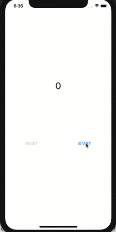

# UseCaseKit

 [](https://codecov.io/gh/crexista/UseCaseKit)

Improved MVVM architecture with unidirectional data flow like a Flux.

Concepts
====
- MVVM にありがちなボイラープレートコードの排除
- 型パラメータを増やしすぎて複雑化させない
- 抽象概念をなるべく減らしてイニシャルコストを下げる
  - 簡単なカウンターアプリを作るのに様々な概念を実装したくない

# Basic Usage
簡単なアプリを作るのであれば以下の3つの概念さえ理解すれば大丈夫です。
- [State](#State)
- [Command](#Command)
- [UseCase](#UseCase)

例として以下の様なストップウォッチアプリを作ります。  


## State
ストップウォッチの状態を以下の様に定義します

```Swift
enum StopWatchState: Equatable {
    case pause(Int)
    case counting(Int)
    case stopped
    
    var count: Int {
        switch self {
        case let .counting(num): return num
        case let .pause(num): return num
        case .stopped: return 0
        }
    }
}
```

## Command
次にストップウォッチを制御する `StopWatchCommand` を定義します。  
コマンドは `Command` protocol を実装する必要があり、
その際にコマンドによって更新される状態を、typealias に定義する必要があります。

```Swift
enum StopWatchCommand: Command {
    typealias State = StopWatchState
    case start
    case stop
    case reset
}
```

## UseCase
次にUseCase実装します。  
UseCase の `init` は以下の様なインターフェースで、
```Swift
init(_ state: Equatable, configure: (Store<Equatable>) -> (Command) -> Void)
```
configure に渡されるクロージャーの引数の Store を操作する事で内部の状態を更新します。  
```Swift
store.update { $0  = .counting($0.count) }
```
Store 更新されると UseCase が持つ `state` も同時に更新されます。  
以下はストップウォッチの状態を、受け取った Command にしたがって Store を操作し更新するコードです。

```Swift
    
let stopWatch: UseCase<StopWatchCommand> = .init(.stopped) { store in
     var timer: Timer?
            
     return {
        switch $0 {
        case .stop:
            timer?.invalidate()
            store.update { $0 = .pause($0.count) }

        case .start:
            timer?.invalidate()
            store.update { $0 = .counting($0.count) }
            timer = .scheduledTimer(withTimeInterval: 1.0, repeats: true) { _ in
                store.update { $0 = .counting($0.count + 1) }
            }

        case .reset:
            guard case .pause = store.currentState else { return }
            timer?.invalidate()
            store.update { $0 = .stopped }
        }
    }
}

```
注目して欲しいのが `var timer: Timer?` の部分です。   
`configure` に渡されるクロージャーが返す、Command をハンドルするクロージャーは Command を受け取るたびに呼ばれますが、  
`configure` に渡されるクロージャー自体は1度しか呼ばれないため Timer を宣言する部分も一度しか呼ばれません。  
コネクションやAPIクライアントの初期化等はこの部分でやるのが良いでしょう。  

## View
最後に UseCase を View から呼び出し UI との紐付け行います。
前述の UseCase の `state` と UI を `sink` させて  
UseCase の状態が更新されるたびに UI も更新される様に実装します。

```Swift
class ViewController: UIViewController {

    @IBOutlet private weak var counterLabel: UILabel!
    @IBOutlet private weak var startButton: UIButton!
    @IBOutlet private weak var resetButton: UIButton!
    @IBOutlet private weak var stopButton: UIButton!
    
    override func viewDidLoad() {
        super.viewDidLoad()
        
        stopWatch.state.sink(on: .main) { [weak self] in
                switch $0 {
                case let .counting(num):
                    self?.counterLabel.text = "\(num)"
                    self?.startButton.isHidden = true
                    self?.resetButton.isEnabled = false
                    self?.stopButton.isHidden = false
                case let .pause(num):
                    self?.counterLabel.text = "\(num)"
                    self?.startButton.isHidden = false
                    self?.resetButton.isEnabled = true
                    self?.stopButton.isHidden = true
                case .stopped:
                    self?.counterLabel.text = "0"
                    self?.startButton.isHidden = false
                    self?.resetButton.isEnabled = false
                    self?.stopButton.isHidden = true
            }
        }
    }

    @IBAction func onTapStartButton(_ sender: Any) { stopWatch.dispatcher.dispatch(.start) }

    @IBAction func onTapResetButton(_ sender: Any) { stopWatch.dispatcher.dispatch(.reset) }

    @IBAction func onTapStopButton(_ sender: Any) { stopWatch.dispatcher.dispatch(.stop) }
}
```

ボタンのタップイベントにフックして Command を発行し、UseCase に dispatch することによって状態変更をリクエストできる様にします。
  
以上が `UseCaseKit` の基本的な使い方になります。
